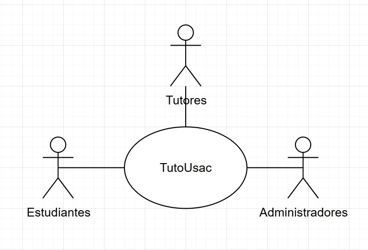
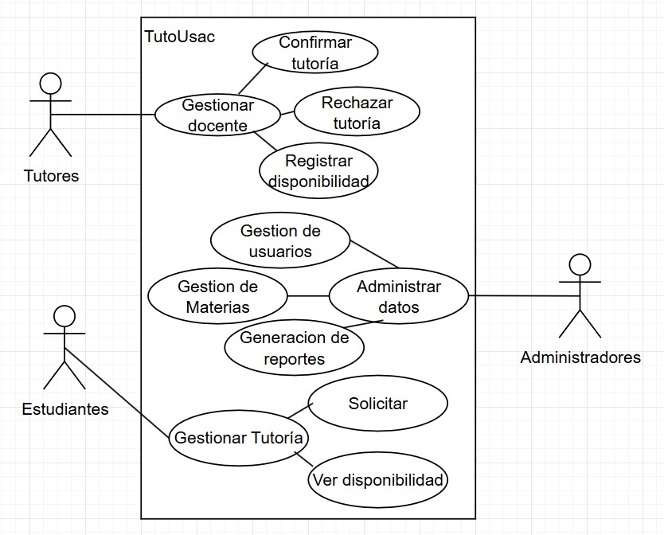

# Caso de laboratorio
---
## Enunciado:
### Sistema de Gestión de Tutorías Universitarias
La Universidad desea implementar un sistema web que permita gestionar las tutorías académicas entre docentes y estudiantes. Actualmente, este proceso se lleva a cabo de manera informal y sin registro alguno, lo cual provoca desorganización, falta de seguimiento y poca trazabilidad.
Con el nuevo sistema, los estudiantes podrán consultar la disponibilidad de los docentes por materia, y solicitar sesiones de tutoría desde su cuenta. Los docentes, a su vez, tendrán la capacidad de registrar su disponibilidad semanal, así como aceptar o rechazar las solicitudes recibidas. Además, el sistema deberá permitir que los administradores gestionen usuarios, materias disponibles y generen reportes sobre la cantidad de tutorías realizadas por estudiante, por docente y por materia.
El sistema debe contar con mecanismos de autenticación y control de acceso según el tipo de usuario.

Requisitos iniciales:
- El sistema deberá estar disponible desde navegadores web.
- Las tutorías pueden realizarse de forma presencial o virtual (el docente puede establecer el tipo de tutoría disponible).
- Cada sesión de tutoría debe quedar registrada con fecha, hora, duración, tema tratado y comentarios del docente.
---
## Core del Negocio
### Descripción
Se necesita un sistema que permita que los estudiantes de la universidad puedan solicitar sesiones de tutoria con docentes registrados en distintas materias. Los docentes podrán gestionar horarios y aceptar o rechazar solicitudes. Los usuarios de la plataforma (estudiantes y maestros) serán gestionados por medio de administradores, quienes pueden manejar datos como horarios disponibles, cursos, y generar reportes.
### Caso de uso de alto nivel

### Primera descomposición

